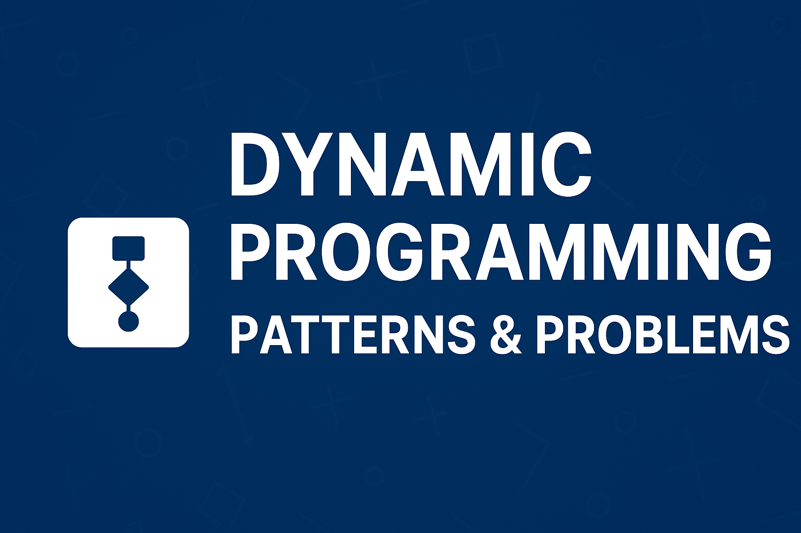

# 🧩 Dynamic Programming Patterns & Problems

This repository contains solutions to **Dynamic Programming (DP) problems**, organized by common patterns.  
I practiced and solved these problems as part of my **FAANG interview preparation**.

---

